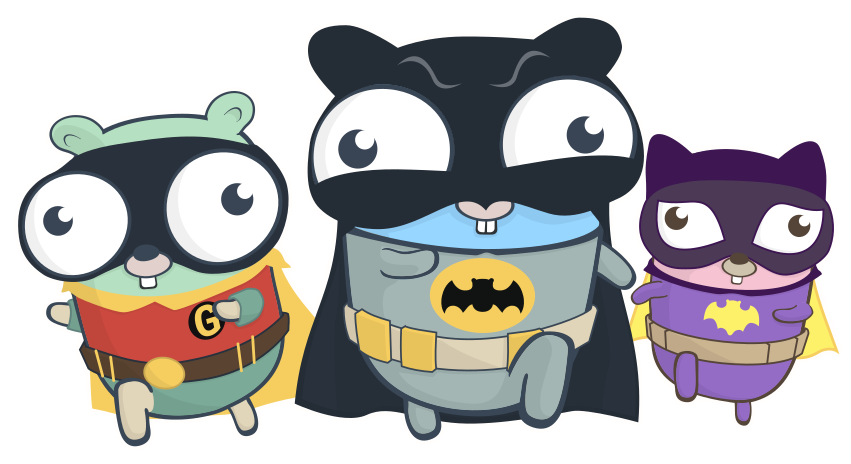

<h2 align="center" style="color: #F75C7E; font-family: 'Comic Sans MS', cursive;">✨ Hello, I'm Justin Tan. ✨</h2>

    

 

<h2 align="center" style="color: #F75C7E; font-family: 'Comic Sans MS', cursive;">🎯 Statistics</h2>

    
    

<h2 align="center" style="color: #F75C7E; font-family: 'Comic Sans MS', cursive;">🚀 Technology Stack</h2>

    
    
    
    
    
    
    
    
    
    
    
    
    

